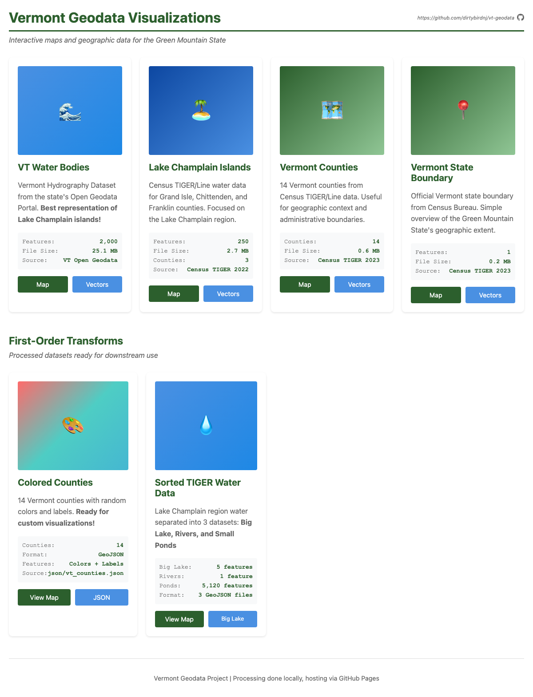

# VT GeoData - Vermont & Lake Champlain Vector Map Pipeline

A geospatial data processing pipeline for creating pen plotter-ready vector maps of Vermont and Lake Champlain.

[](https://dirtybirdnj.github.io/vt-geodata/)

## Project Goals

- Download and process royalty-free vector datasets from multiple sources
- Visualize and compare dataset quality and coverage
- Generate clean SVG files optimized for pen plotting
- Focus on Vermont boundaries with detailed Lake Champlain islands representation

## Data Sources

1. **Vermont Open Geodata Portal** - State boundaries and hydrography
2. **USGS National Map** - Lake Champlain shorelines and elevation
3. **US Census TIGER** - Water bodies and administrative boundaries

## Project Structure

```
vt-geodata/
├── data/              # Downloaded raw geospatial data
│   ├── raw/          # Original shapefiles
│   └── processed/    # Cleaned and merged datasets
├── output/           # Generated SVG files
├── notebooks/        # Jupyter notebooks for exploration
├── src/              # Python processing scripts
│   ├── download.py   # Data acquisition
│   ├── explore.py    # Dataset visualization
│   ├── process.py    # Geometry processing
│   └── export.py     # SVG export
├── requirements.txt  # Python dependencies
└── README.md
```

## Setup

```bash
# Create virtual environment
python -m venv venv
source venv/bin/activate  # On Windows: venv\Scripts\activate

# Install dependencies
pip install -r requirements.txt
```

## Workflow

1. **Download datasets**: `python src/download.py`
2. **Explore data**: Use notebooks or `python src/explore.py`
3. **Process geometries**: `python src/process.py`
4. **Export to SVG**: `python src/export.py`

## Output Specifications

- Coordinate system: WGS84 or VT State Plane
- SVG optimization: Simplified paths, minimal detail
- Focus area: Vermont boundaries with Lake Champlain islands
- Border areas: NY, NH, MA, QC excluded or minimized

## GitHub Pages

Static visualizations are hosted via GitHub Pages in the `docs/` folder.

**Publishing workflow:**
1. Generate visualizations locally using the scripts above
2. Copy HTML maps to `docs/` folder: `cp output/*.html docs/`
3. Commit and push: `git add docs/ && git commit -m "Update visualizations" && git push`
4. Maps will be available at: `https://dirtybirdnj.github.io/vt-geodata/`

Note: All data processing happens locally - only static HTML files are published to GitHub Pages.

## Screenshot Automation

Automatically capture screenshots of your HTML visualizations using Playwright:

```bash
# Activate virtual environment (if not already active)
source venv/bin/activate

# Run the screenshot script
python src/screenshot.py
```

Screenshots are saved to the `screenshots/` folder and can be used in documentation, README files, or shared on social media.

**Customization:** Edit `src/screenshot.py` to:
- Add more HTML files to capture
- Change viewport size (default: 1200x800)
- Adjust wait times for map tiles to load
- Modify output format or quality
